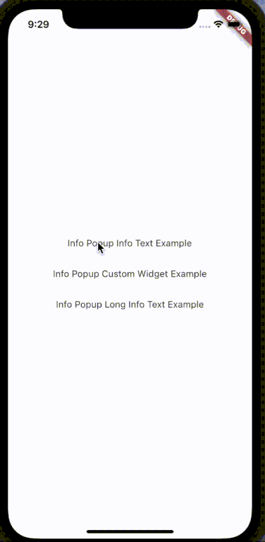
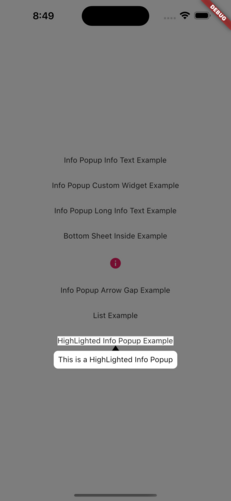

# Info Popup

The simple way to show the user some information on your selected widget. 

Now more effective with the **highlight** feature.

You can test now [Info Popup](https://info-popup.web.app/#/ "Info Popup")

## Features

- Info holder with dynamic size
- Fully editable content area





## Getting started

### Use this package as a Library
---
Depend On it

Run this command

with Dart:

```
$ dart pub add info_popup
```

with Flutter:

```
$ flutter pub add info_popup
```

This will add a line like this to your package's pubspec.yaml (and run an implicit `dart pub get` or `flutter pub get`):

```
dependencies:
  info_popup: ^1.0.0
```

## Usage

All you have to do is wrap it in the widget you want to show information with **InfoPopupWidget**. With **InfoPopupController**, you can customize it as you wish, and turn it off and on.

##### Normal Info Text Using
```dart
              InfoPopupWidget(
                contentTitle: 'Info Popup Details',
                arrowTheme: InfoPopupArrowTheme(
                  color: Colors.pink,
                  arrowDirection: ArrowDirection.up,
                ),
                contentTheme: InfoPopupContentTheme(
                  infoContainerBackgroundColor: Colors.black,
                  infoTextStyle: TextStyle(color: Colors.white),
                  contentPadding: const EdgeInsets.all(8),
                  contentBorderRadius: BorderRadius.all(Radius.circular(10)),
                  infoTextAlign: TextAlign.center,
                ),
                dismissTriggerBehavior: PopupDismissTriggerBehavior.onTapArea,
                areaBackgroundColor: Colors.transparent,
                indicatorOffset: Offset.zero,
                contentOffset: Offset.zero,
                onControllerCreated: (controller) {
                  print('Info Popup Controller Created');
                },
                onAreaPressed: (InfoPopupController controller) {
                  print('Area Pressed');
                },
                infoPopupDismissed: () {
                  print('Info Popup Dismissed');
                },
                onLayoutMounted: (Size size) {
                  print('Info Popup Layout Mounted');
                },
                child: Icon(
                  Icons.info,
                  color: Colors.pink,
                ),
              ),
```

##### Custom Popup Widget
```dart
              InfoPopupWidget(
                customContent: Container(
                  decoration: BoxDecoration(
                    color: Colors.blueGrey,
                    borderRadius: BorderRadius.circular(10),
                  ),
                  padding: const EdgeInsets.all(10),
                  child: Column(
                    children: const <Widget>[
                      TextField(
                        decoration: InputDecoration(
                          hintText: 'Enter your name',
                          hintStyle: TextStyle(color: Colors.white),
                          enabledBorder: OutlineInputBorder(
                            borderSide: BorderSide(color: Colors.white),
                          ),
                        ),
                      ),
                      SizedBox(height: 10),
                      Center(
                        child: Text(
                          'Example of Info Popup inside a Bottom Sheet',
                          style: TextStyle(
                            color: Colors.white,
                          ),
                        ),
                      ),
                    ],
                  ),
                ),
                arrowTheme: const InfoPopupArrowTheme(
                  color: Colors.pink,
                  arrowDirection: ArrowDirection.up,
                ),
                dismissTriggerBehavior: PopupDismissTriggerBehavior.onTapArea,
                areaBackgroundColor: Colors.transparent,
                indicatorOffset: Offset.zero,
                contentOffset: Offset.zero,
                onControllerCreated: (controller) {
                  print('Info Popup Controller Created');
                },
                onAreaPressed: (InfoPopupController controller) {
                  print('Area Pressed');
                },
                infoPopupDismissed: () {
                  print('Info Popup Dismissed');
                },
                onLayoutMounted: (Size size) {
                  print('Info Popup Layout Mounted');
                },
                child: Icon(
                  Icons.info,
                  color: Colors.pink,
                ),
              ),
```